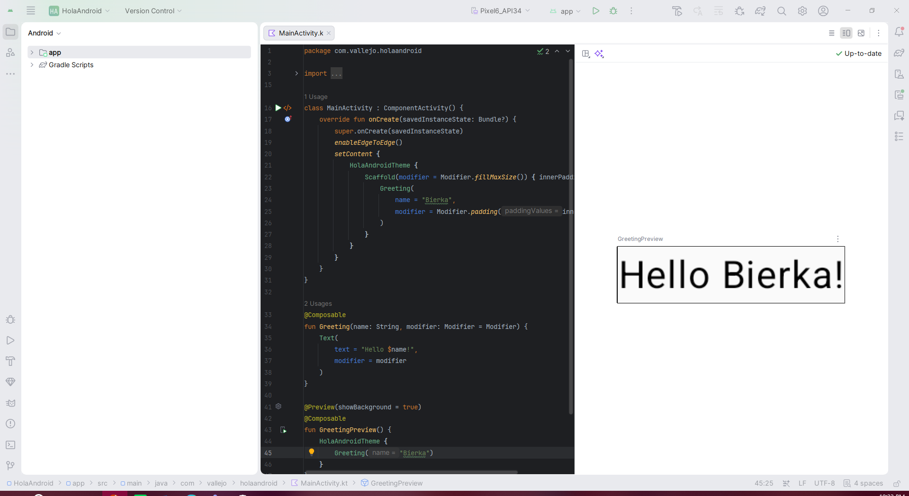

# Práctica 1 — Configuración del Entorno
**Asignatura:** IDS-368 · Desarrollo Android con Kotlin — Nivel 1 Junior  
**Institución:** UNICDA  

---

## Respuestas del Ejercicio 4

### 1. `app/src/main/AndroidManifest.xml`
* **¿Qué contiene?**  
  Es el archivo de configuración global del proyecto. Declara los componentes principales (Activities, Services, Broadcast Receivers), los permisos del sistema que requiere la app, el icono y el tema general.
* **¿Qué es el atributo `android:name` en `<activity>`?**  
  Especifica el nombre de la clase Kotlin/Java asociada a esa pantalla (por ejemplo, `.MainActivity`). Le indica al sistema qué clase debe instanciar al iniciar la pantalla.

### 2. `app/build.gradle.kts`
* **¿Cuál es el valor de `minSdk`?**  
  `24` (Android 7.0 Nougat). Define el nivel mínimo de API necesario para instalar y ejecutar la app.
* **¿Cuál es el valor de `compileSdk`?**  
  `34` (Android 14.0). Define la versión del SDK del sistema contra la cual se compila el código.

### 3. `libs.versions.toml`
* **¿Qué versión de Kotlin está configurada?**  
  Está definida en el bloque `[versions]` bajo la clave `kotlin` (generalmente `2.0.0` o superior). Este archivo gestiona y centraliza las versiones de librerías y plugins del proyecto.

### 4. `app/src/main/java/.../MainActivity.kt`
* **¿Qué función llama para mostrar la UI?**  
  Utiliza la función **`setContent { ... }`** dentro del método `onCreate` para definir e invocar los composables de Jetpack Compose que renderizan la interfaz gráfica.

---

## Captura de Pantalla

